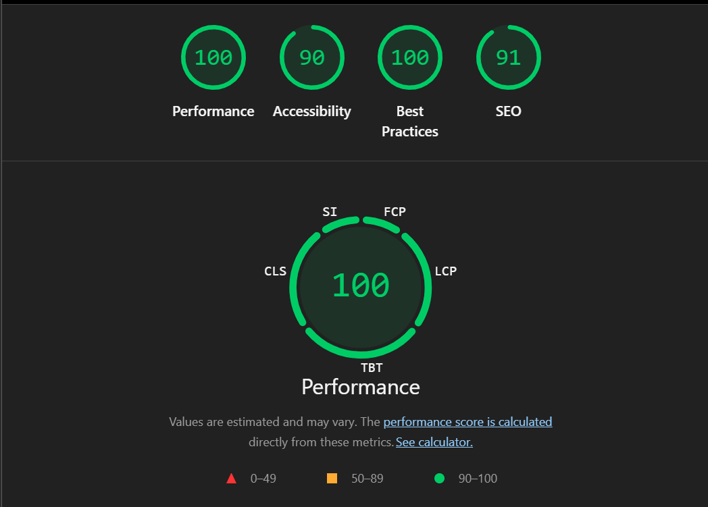

# 🍳 Frying Pan — Kids Friendly Website  

  
  
  
  
  

A **multi-page, accessible, and responsive website** built using **HTML5 & CSS3**.  
This project was created as part of **Assignment 01 — HTML & CSS**, with the goal of applying modern web development standards while keeping the design fun and kid-friendly.

---

## 🌟 Features Implemented

### 🏠 Pages
- **index.html** — Homepage with headings, text styling, lists, table, media, and links.  
- **about.html** — Structured with `<article>` and `<section>`, styled elements, button animations, and collapsible content.  
- **contact.html** — Interactive form with various input types, validation, and a downloadable brochure link.  

All pages share a **consistent navigation bar**, header, and footer.

### 🎨 HTML & CSS
- **Semantic HTML5 tags**: `<header>`, `<main>`, `<footer>`, `<article>`, `<section>`, `<figure>`, `<figcaption>`, `<details>`, `<summary>`, `<dialog>`.  
- **Lists**: unordered, ordered, and description list.  
- **Tables**: complete with `<caption>`, `<thead>`, `<tbody>`, `<tfoot>`.  
- **Media**: responsive images (`<picture>`), audio/video with captions, and embedded files.  
- **Forms**: text, email, URL, date, color, range, checkboxes with proper labels and validation.  
- **CSS Features**:  
  - Variables for theme colors  
  - Flexbox and Grid layouts  
  - Box model (margin, padding, border)  
  - Responsive typography with `clamp()`  
  - Hover transitions and button animations  
  - Responsive gallery with 6+ images  
  - Media queries for screens ≤ 600px    
  - Print-friendly stylesheet with `@media print`  

### ⚡ Advanced Features
- **Bootstrap (CDN)** used for components like navbar/cards.  
- **Native `<dialog>` element** with JavaScript trigger.  
- **Lazy loading** for non-critical images.  
- **Favicon + Open Graph meta tags** for better sharing preview.  

---

## ✅ Accessibility Improvements
- Alt text for all meaningful images (empty `alt=""` for decorative ones).  
- ARIA roles (`navigation`, `main`, `contentinfo`) for better screen reader support.  
- Proper color contrast following **WCAG 2.1 AA**.  
- Visible focus styles for keyboard navigation.  
- Tested with **keyboard only navigation** and screen readers.  

---

## 🔍 SEO & Performance Enhancements
- Added `<meta name="description">` for each page.  
- Open Graph tags for social media previews.  
- Optimized images with `loading="lazy"`.  
- Lighthouse improvements: 
  - Performance enhanced by optimizing CSS and images.  

---

## 📊 Lighthouse Report
- **Before**: Accessibility and performance were below standard.  
- **After fixes**: Accessibility ≥ 90, SEO and Best Practices improved significantly.

---

## 🚀 Deployment
The website is hosted with **GitHub Pages**.  
👉 [Live Demo](https://muhammad-subhan456.github.io/Frying_Pan/)  

---

## 📂 Project Structure
```
Frying_Pan/
│── index.html              # Homepage
│── about.html              # About page
│── contact.html            # Contact page
│
├── assets/
│   ├── css/
│   │   └── styles.css      # Main stylesheet
│   │
│   ├── images/
│   │   ├── preview.png     # Screenshot used in README
│   │   └── (other images)  # Website images
│   │
│   └── media/
│       ├── video.mp4       # Example video
│       ├── audio.mp3       # Example audio
│       └── brochure.pdf    # Downloadable brochure
│
└── README.md               # Documentation
```



